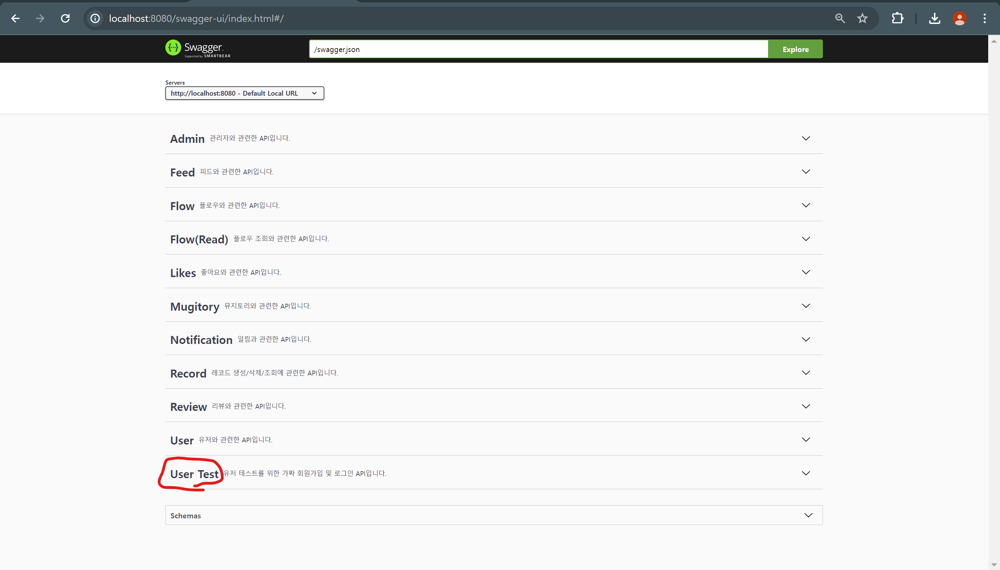
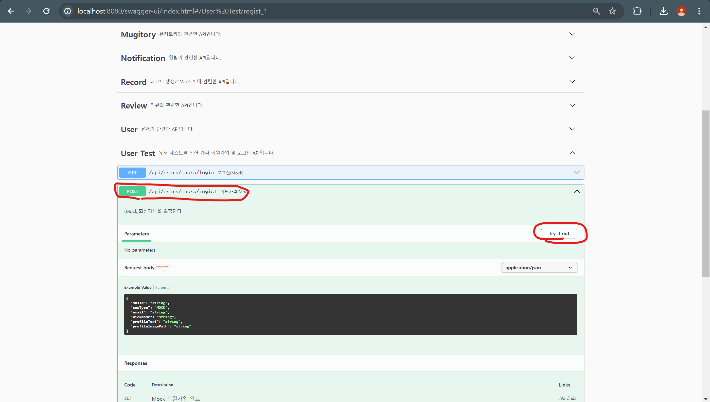

# JMETER

## 사전 세팅

### 1. 사용자 회원가입

1. WAS(Backend), SSE Server Docker로 실행(각 프로젝트 경로에 있는 README 참조)
2. swagger 접속(http://localhost:8080/swagger)
3. Mock 회원가입

### 2. JMeter 실행

### 3. JMeter 설정 불러오기
