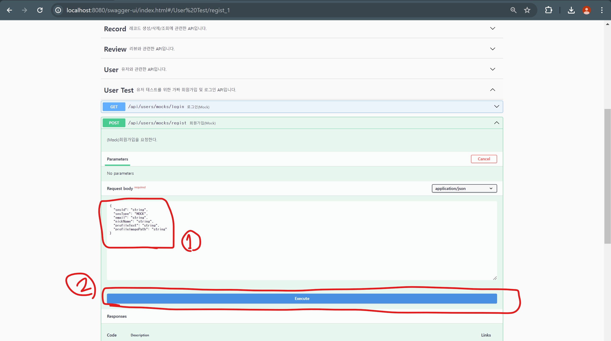

# JMETER

## 사전 세팅

### 1. 사용자 회원가입

1. WAS(Backend), SSE Server Docker로 실행(각 프로젝트 경로에 있는 README 참조)
2. swagger 접속(http://localhost:8080/swagger)
  

3. Mock 회원가입
  - 회원가입으로 이동(/api/users/mocks/regist > Try it out)
    
  - 1번 화면에 아래 유저정보 붙여넣고 실행(Execute)
    ```javascript
    {
      "snsId": "sse_test_user_id",
      "snsType": "MOCK",
      "email": "mock@example.com",
      "nickName": "sse_test_user",
      "profileText": "test sse server",
      "profileImagePath": "/test"
    }
    ```
    

### 2. JMeter 실행
```shell
cd {프로젝트 경로}/jmeter/apache-jmeter-5.6.3/lib
./jmeter
```

### 3. JMeter 설정 불러오기

1. file > open


2. SSE Server Test Thread Group.jmx > open

